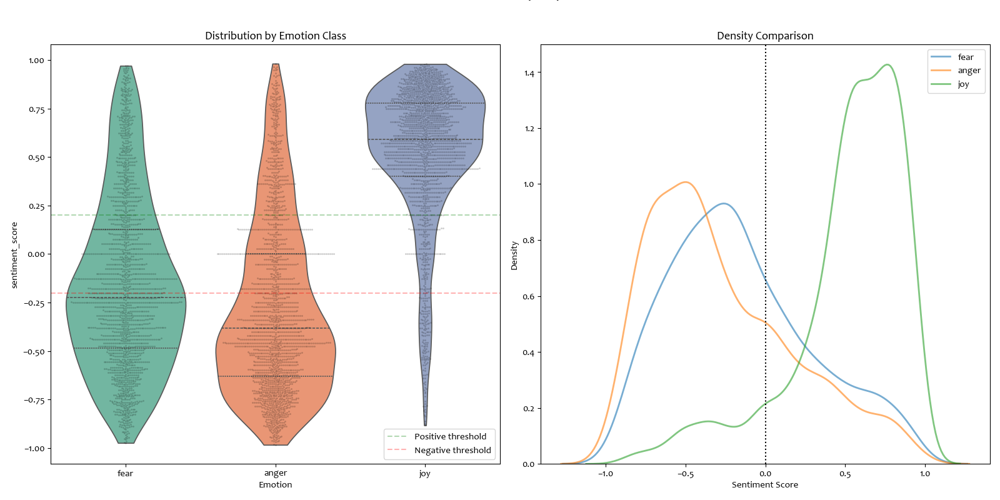

# **Emotional Text Analysis: Natural Language Preprocessing**

<div align="center">  

[](https://opensource.org/licenses/MIT)  [](https://python.org)  [](https://en.wikipedia.org/wiki/Natural_language_processing)  [](https://github.com/cjhutto/vaderSentiment)  [](https://en.wikipedia.org/wiki/Text_mining)  [](https://pandas.pydata.org)  [](https://numpy.org)  [](https://www.nltk.org)  [](https://spacy.io)  [](https://matplotlib.org)  [](https://seaborn.pydata.org)  [](https://github.com/amueller/word_cloud)  [](https://scikit-learn.org)  [](https://tensorflow.org)  [](https://jupyter.org) [](https://github.com/Jabulente)  [](https://linkedin.com/in/jabulente-208019349)  [](https://x.com/Jabulente)  [](https://instagram.com/Jabulente)  [](https://threads.net/@Jabulente) [](https://tiktok.com/@Jabulente)  [](mailto:Jabulente@hotmail.com)  

</div>

<hr>

## Overview
This repository provides an **exploratory analysis and sentiment classification** of user comments. The project focuses on **performing sentiment analysis across different emotional categories**, identifying patterns in textual data, and visualizing the distribution of sentiments. By leveraging **VADER Sentiment Analysis** and text preprocessing techniques, this project aims to extract insights into how users express different emotions and the sentiment polarity (positive, neutral, negative) of their comments.




---

## Features

- **Exploratory Data Analysis (EDA)**: Analyze trends and distributions in the dataset.
- **Text Preprocessing**: Clean, tokenize, and normalize text for accurate sentiment analysis.
- **Sentiment Classification**: Categorize comments as **positive, neutral, or negative** using **VADER**.
- **Emotion-Based Sentiment Analysis**: Compare sentiment scores across different emotion classes (e.g., anger, joy, sadness).
- **Visualizations**:
  - **Bar charts** for sentiment distribution.
  - **Word clouds** for commonly used words within sentiment categories.
  - **Phrase frequency analysis** for detecting key terms.
- **Adaptable Pipeline**: Easily apply the workflow to different comment-based datasets.

---

## Applications
This project is useful for:

- **Social Media Monitoring**: Identify sentiment trends in online comments.
- **Customer Feedback Analysis**: Evaluate customer sentiments towards products or services.
- **Public Opinion Analysis**: Assess sentiment variations across topics and user-generated content.
- **General Text-Based Sentiment Exploration**: Explore sentiment tendencies in any collection of comments.

---

## Technologies Used
- **Python**
- **NLTK (Natural Language Toolkit)** for text processing
- **VADER (Valence Aware Dictionary and sEntiment Reasoner)** for sentiment classification
- **Matplotlib & Seaborn** for visualizations
- **Pandas & NumPy** for data handling
- **WordCloud** for text-based visual representation

---

## Installation & Setup
To run this project, follow these steps:

### Prerequisites
Ensure you have **Python 3.7+** and install the required libraries:
```bash
pip install -r requirements.txt
```

Here's a more concise and action-oriented version:

---

### Running the Analysis

1. Clone the repository:
   ```bash
   [git clone https://github.com/your-username/sentiment-analysis.git](https://github.com/Jabulente/Natural-Language-Preprocessing-.git)
   cd 001-Emotional-Text-Analysis
   ```

2. **Launch Jupyter Notebook**:
   ```bash
   jupyter notebook
   ```

3. **Open the Analysis Notebook**:
   - Open `Emotional Text Analysis (NLP).ipynb`

4. **Run All Cells**:
   - Use `Kernel > Restart & Run All` to execute the full pipeline

4. **View Results**:
   - Interactive visualizations will render in the notebook
   - Exported charts save to `Visualizations/`
  

## Dataset
The dataset consists of user comments with the following columns:
- **Text**: The user-generated comment.
- **Emotion Label**: The general emotional category of the comment.

A sample dataset is included, but you can use your own dataset for custom analysis.

---

## Future Enhancements
- **Real-Time Sentiment Tracking** for live comment analysis.
- **Advanced NLP Models** (e.g., Transformer-based models for improved sentiment classification).
- **Multi-Language Support** to expand beyond English text analysis.

---

## Contributing
Contributions are welcome! Feel free to fork the repository, create feature branches, and submit pull requests. For major changes, open an issue to discuss proposed modifications.

---

## License
This project is licensed under the **MIT License** – see the [LICENSE](LICENSE) file for details.

---

## Contact

This analysis was performed by **Jabulente**, a passionate and dedicated data scientist with a strong commitment to using data to drive meaningful insights and solutions. For inquiries, collaborations, or further discussions, please feel free to reach out via.  

    
<div align="center"> 
  
[](https://github.com/Jabulente)  [](https://linkedin.com/in/jabulente-208019349)  [](https://x.com/Jabulente)  [](https://instagram.com/Jabulente)  [](https://threads.net/@Jabulente) [](https://tiktok.com/@Jabulente)  [](mailto:Jabulente@hotmail.com)  
</div>
<hr>
